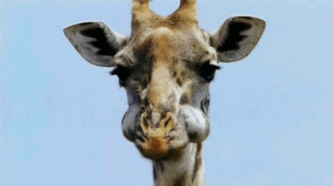
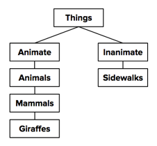

## Week 3 


### OBJECTS & CLASSES
* **Objects** are a way of organizing code in a program and breaking things down to make it easier to think about complex ideas.
* **Classes** define classes (types of objects, groups) 


### BREAKING THINGS INTO CLASSES

* Objects are defined by classes - a to do this is to classify objects into groups
* Use classes to organize bits of code
* An object is like a “member” of a class
```python
class Things:
    pass
```
* We define classes by using the **class** keyword followed by a name. When we create classes we start with the broadest class first. In this case, we use the keyword **pass** to let Python know we do not have any more information for this class at this time. 

### ADDING OBJECTS TO CLASSES
* An object of a class is also referred to as an instance of a class
```python
geoffrey = Giraffes()
```
* This code tells Python to create an object in the Giraffes class and assign it to the variable **geoffrey**.
* Like a function there are parenthesis after the class name. This is so we can use parameters when we create new objects.

### FUNCTIONS OF CLASSES
* We define a function in a class the same way we call one normally, but the indentation is beneath the class function.
```python
class SillyClass:
    def functionOne():
        print('this is function 1')
    def functionTwo():
        print('this is function 2')
```
* We can add **characteristics** to each class to say what it can and cannot do. A characteristic is a trait that all of the members of the class (and its children) share.

* These **characteristics** can be thought of as actions or **functions** - things an object of that class can do. The **self** parameter is a way for one function to call another function in the class (and in the parent class).
```python
class Animals(Things):
    def breathe(self):
        pass
    def move(self):
        pass
    def eatFood(self):
        pass
```
* We often created classes with functions that do nothing (using **pass**) as a way to figure out what the class should do, before getting into the details of the individual functions. 
* Each class can use the characteristics (functions) of its parent, so we don’t have to make really complicated class – we put the functions at the highest parent where the characteristic applies.

### FUNCTIONS CALLING OTHER FUNCTIONS
* To have a function called in a class we use the self parameter to allow us to call another function. Here is an example:
```python
class Giraffes(Mammals):
    def findFood(self):
        self.move()
        print('i found some food')
        self.eatFood()
```
* Often we will write functions that will do something useful, which we can then use inside another function. 
* By calling functions in this way we can call a single function that does more then just one thing. 
```python
def dance(self):
    self.move()
    self.move()
    self.move()
```

### INITIALIZING AN OBJECT
* Sometimes when we create an object we want to set some values (also called properties) for later use. When we **initialize** the object, we are really just getting it ready for use. 
* **__init__** is a special type of function in Python classes and must have this name. It sets the properties for an object when it is first created. It is automatic (we don’t have to call it as a function!)
```python
class Giraffes:
    def __init__(self, spots):
        self.giraffeSpots = spots
```
* Just like the other functions we created within the class, the **__init__** function needs the first parameter to be **self**. Next, we set the parameter to the object variable. Just as we call the object functions using self, variables in the class are also accessed using self. 
```python
geoffrey = Giraffes(100)
april = Giraffes(150)
print(april.giraffeSpots)
```
* When we create an object of a class with an **__init__** function, it has the same effect as actually calling the function, so we need to include a parameter to pass.
* When we create an object of a class, we can refer to its variables or functions using the dot operator and the name of the variable or function we want to use. 

### WHY USE OBJECTS & CLASSES
* After we create an object, we can call and run functions provided by its class (and its parents class). We call the function by using the dot operator and the name of the function like this:
```python
geoffrey = Giraffes()
geoffery.move()
geoffery.eatFromTrees()
```
* We can create more objects, and because we are using objects and classes we tell Python exactly which object to do what. 
```python
geoffrey = Giraffes()
april = Giraffes()
april.move()
geoffery.eatFromTrees()
```

### In-class Exercises/Challenges: 
    * Create a program to calculate our weight on the moon (or any planet):
        * Create function to take the starting weight and increase the weight each year
        * Modify the function so that you can change the amount of years
        * Take input from the user for each and then display how much the user would weigh
    * Create a class named Giraffe. 
        * Give the class functions that represent things a giraffe would do. (i.e. eat, sleep, left foot forward, right foot forward, etc.)
        * Make a function within the Giraffe class to make the giraffe dance by calling other functions within the class. 
        * Make an instance of the Giraffe, and make the instance dance.
        * Make two instances and make them both do different things. 
        * Make two instances of the Giraffe class, that have a different number of spots (characteristics).
    * Create a class that can be used for all the drivers used in Mario Kart
    * Create a class that can be used for all the karts used in Mario Kart

### VOCABULARY:
* class
* initialize
* instance 
* object

### KEYWORDS:
* class 
* pass 
